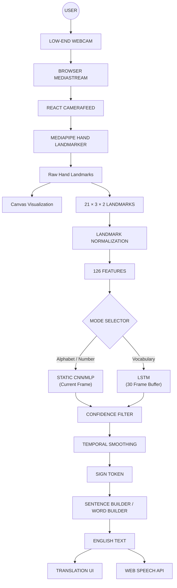

# System Architecture

## High-Level Architecture

```mermaid
graph TD
    USER((USER)) --> WEBCAM["LOW-END WEBCAM"]
    WEBCAM --> BROWSER["BROWSER MEDIASTREAM"]
    BROWSER --> REACT_CAM["REACT CAMERAFEED"]
    REACT_CAM --> MP["MEDIAPIPE HAND LANDMARKER"]
    MP --> RAW_LM["Raw Hand Landmarks"]
    RAW_LM --> CANVAS["Canvas Visualization"]
    RAW_LM --> LM["21 × 3 × 2 LANDMARKS"]
    LM --> NORM["LANDMARK NORMALIZATION"]
    NORM --> FEAT["126 FEATURES"]
    
    FEAT --> ROUTER{"MODE SELECTOR"}
    
    ROUTER -- Alphabet / Number --> STATIC_MODEL["STATIC CNN/MLP<br>(Current Frame)"]
    ROUTER -- Vocabulary --> DYNAMIC_MODEL["LSTM<br>(30 Frame Buffer)"]
    
    STATIC_MODEL --> CONF["CONFIDENCE FILTER"]
    DYNAMIC_MODEL --> CONF
    
    CONF --> TEMP["TEMPORAL SMOOTHING"]
    TEMP --> TOKEN["SIGN TOKEN"]
    TOKEN --> BUILDER["SENTENCE BUILDER / WORD BUILDER"]
    BUILDER --> TEXT["ENGLISH TEXT"]
    
    TEXT --> FRONTEND_OUT["TRANSLATION UI"]
    TEXT --> TTS["WEB SPEECH API"]
```

## Details
See Implementation Plan for component details.
